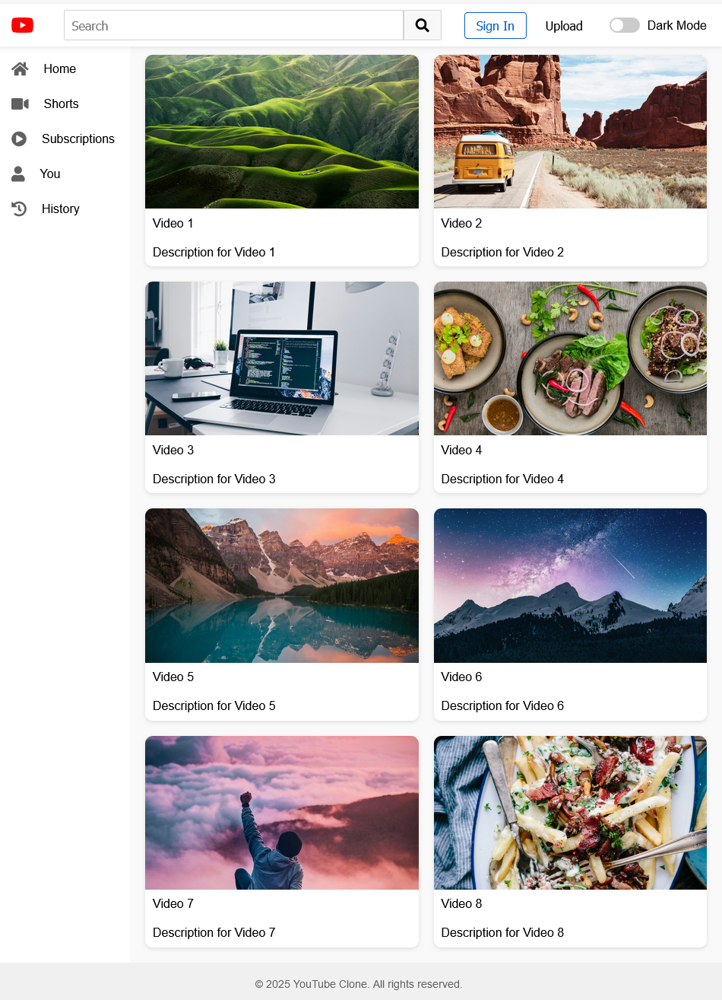
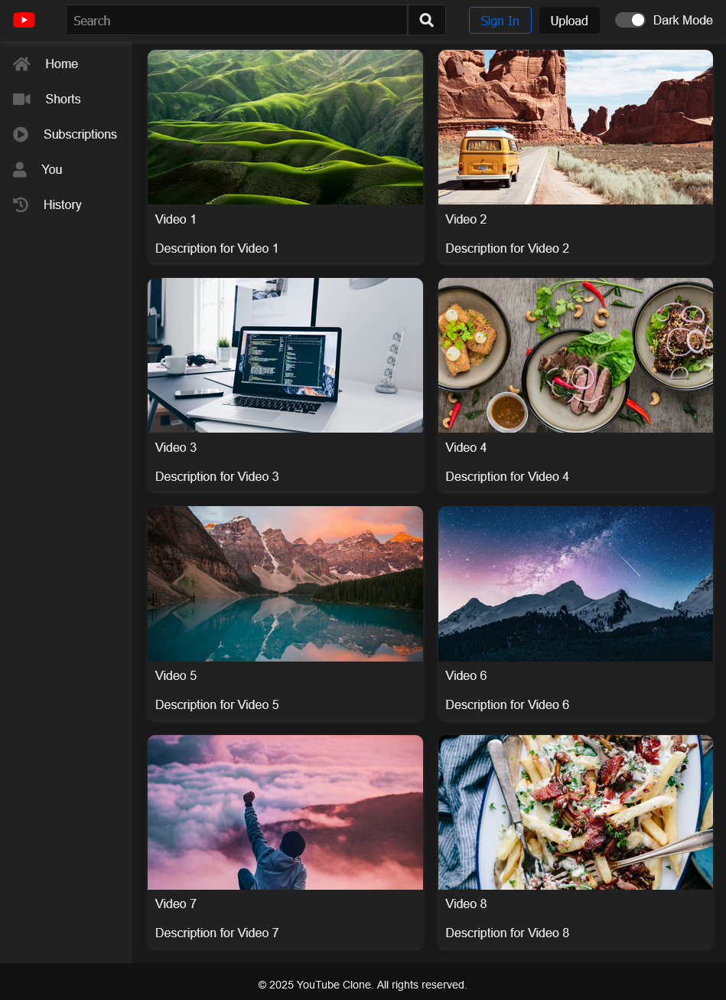

# YouTube Clone (Beginner HTML & CSS Project)

This repository contains the code for a basic YouTube clone, built using HTML and CSS. It's designed as a beginner-friendly project to help those learning web development practice their skills and understand fundamental concepts.

## Features

-   **Responsive Design:** The layout adapts to different screen sizes, ensuring a good user experience on desktops, tablets, and mobile devices.
-   **Video Grid:** Displays a grid of video thumbnails, mimicking the layout of the YouTube homepage.
-   **Basic Header:** Includes a YouTube logo, a search bar, and placeholder account buttons.
-   **Sidebar Navigation:** A sidebar with basic navigation links (Home, Shorts, Subscriptions, You, History).
-   **Dark Mode:** A toggle to switch between light and dark color themes.
-   **Hover Effects:** Interactive hover effects on video items, buttons, and sidebar links.
-   **Realistic Styling:** The look and feel are inspired by the actual YouTube website.
-   **Up to date Logo**: The correct Youtube logo is displayed.

## Technologies Used

-   **HTML5:** For structuring the web page.
-   **CSS3:** For styling and layout.
-   **Font Awesome:** For icons.

## Preview

Here are previews of the YouTube Clone in both light and dark modes:

### Light Mode

### Dark Mode

## How to Run

1.  Clone the repository to your local machine.
2.  Open the `index.html` file in your web browser.

## Contributions

This project is intended for learning and practice. Feel free to fork the repository and experiment with your own improvements!
